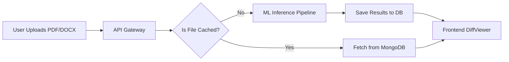

<p align="center">
  
</p>

<h1 align="center">🏛️ ClauseEase</h1>

<p align="center">
  <b>Microservices-Based Legal Document Analysis Platform</b><br>
  Built with React • Node.js • FastAPI • HuggingFace
</p>

<p align="center">
  
  
  
  
  
</p>

---

## 📑 Table of Contents
- [✨ Core Features](#-core-features)
- [🏗️ System Architecture](#️-system-architecture)
- [📂 Project Structure](#-project-structure)
- [🚀 Getting Started](#-getting-started)
- [🎮 How It Works](#-how-it-works)

---

## ✨ Core Features

* **Sleek, Responsive UI:** A dark "Sleek" aesthetic (`#0A0F1E` navy, `#00C9B1` teal) featuring a synchronized Side-by-Side Diff Viewer and SVG Readability charts.
* **Instant Caching Layer:** Dynamically computes SHA-256 hashes of uploaded files. If a file was analyzed previously, results are fetched instantly from MongoDB, bypassing the ML engine.
* **Advanced NLP Engine:** Leverages HuggingFace Transformers (`bert-mini`, `flan-t5-small`) and spaCy for intelligent clause detection and text simplification.
* **Automated Scoring:** Features a custom mathematical implementation of the Flesch-Kincaid readability formula, mapping scores to standard US Grade Levels.
* **Secure:** JWT-based protected routes and robust bcrypt password hashing.

---

## 🏗️ System Architecture

The application is divided into three distinct microservices interacting over a local Docker network:

1.  **💻 Frontend (`/frontend`):** React.js + Vite + Tailwind CSS. Handles file drag-and-drop (`react-dropzone`) and complex data visualizations.
2.  **🔀 API Gateway (`/gateway`):** Node.js + Express. Acts as the middleman. Orchestrates JWT auth, multi-part file uploads (`multer`), MongoDB history storage, and the hashing/caching logic.
3.  **🧠 ML Engine (`/ml_service`):** Python + FastAPI. A dedicated asynchronous service that runs the heavy NLP inference pipeline without blocking the main gateway.

---

## 📂 Project Structure

<details>
<summary><b>Click to expand the full folder directory</b></summary>

```text
📦 ClauseEase
 ┣ 📂 frontend
 ┃ ┣ 📂 src
 ┃ ┃ ┣ 📂 api         # Axios client with JWT interceptors
 ┃ ┃ ┣ 📂 components  # DiffViewer, ReadabilityScore, Dropzone
 ┃ ┃ ┣ 📂 context     # AuthContext for global state
 ┃ ┃ ┗ 📂 pages       # Dashboard, Login, History
 ┃ ┗ 📜 vite.config.js
 ┣ 📂 gateway
 ┃ ┣ 📂 middleware    # authMiddleware, hashMiddleware
 ┃ ┣ 📂 models        # Mongoose Schemas (User, Document)
 ┃ ┣ 📂 routes        # auth.js, documents.js
 ┃ ┗ 📜 server.js     # Express entry point
 ┣ 📂 ml_service
 ┃ ┣ 📂 modules       # M1 to M5 pipeline modules
 ┃ ┣ 📂 utils         # Readability algorithms
 ┃ ┣ 📜 main.py       # FastAPI endpoints
 ┃ ┗ 📜 requirements.txt
 ┗ 📜 docker-compose.yml
```
</details>

---

## 🚀 Getting Started

### 🐳 Method 1: Docker Deployment (Recommended)
The fastest way to spin up the entire microservices architecture. Ensure [Docker Desktop](https://www.docker.com/products/docker-desktop/) is installed.

```bash
# 1. Clone the repository and navigate to the root folder
cd ClauseEase

# 2. Build and start all containers (Frontend, Node, Python, MongoDB)
docker-compose up --build
```
*Access the dashboard at `http://localhost:3000`*

### ⚙️ Method 2: Manual Local Setup
If you prefer running services independently for development. Requires Node.js (v18+), Python (v3.10+), and MongoDB.

**1. Start the ML Engine (Terminal 1)**
```bash
cd ml_service
python3 -m venv venv
source venv/bin/activate  # Windows: venv\Scripts\activate
pip install -r requirements.txt
python -m spacy download en_core_web_sm
uvicorn main:app --host 0.0.0.0 --port 8000 --reload
```

**2. Start the API Gateway (Terminal 2)**
```bash
cd gateway
npm install
cp .env.example .env  # Defaults to localhost MongoDB
npm run start
```

**3. Start the Frontend (Terminal 3)**
```bash
cd frontend
npm install
npm run dev
```

---

## 🎮 How It Works

Below is the simple data lifecycle of a document processed through the ClauseEase pipeline:



*Built with ❤️ for a more transparent legal world.*
